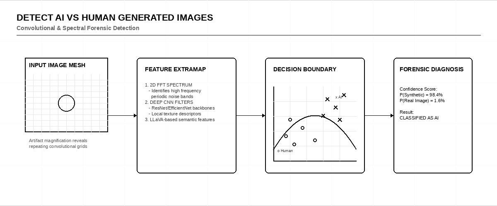
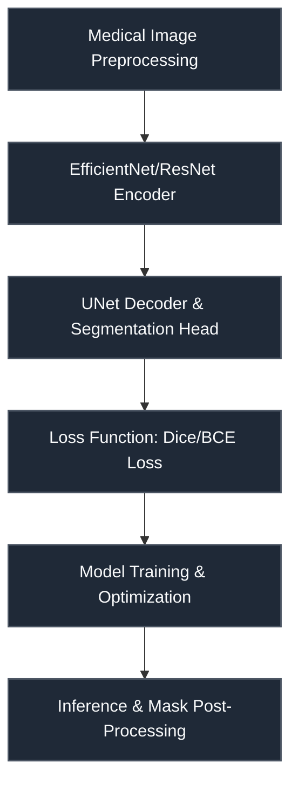

# Detect AI vs Human Generated Images

 

> **Host:** [`Kaggle Community`]  
> **Platform Link:** [Kaggle Competition](https://www.kaggle.com/competitions/detect-ai-vs-human-generated-images)  
> **Dataset Link:** [Kaggle Dataset](https://www.kaggle.com/competitions/detect-ai-vs-human-generated-images/data)  
> **Domain:** `Deepfake & AI Image Detection`

## Overview

This repository contains the developmental workspace and notebooks for the **Detect AI vs Human Generated Images** project. The primary focus of this project is in the domain of **Deepfake & AI Image Detection** on Kaggle Community. The codebase represents an iterative implementation of machine learning pipelines, structured to process datasets, train models, and validate predictions.

### Technical Methodology & Implementation

The codebase features a total of 559 cells across 67 notebook(s). The system implements several key architectural elements:
- **Core Classes**: Custom object-oriented structures are defined to manage state and logic, including: `EffnetModel`, `customiser`.
- **Key Algorithms & Utilities**: Procedural helpers and utilities facilitate operations, notably: `LoG_filter`, `__init__`, `forward`, `image_extracter`, `loss_optimizer`, `submission_div`, `train`.
- **Training & Optimization**: Includes optimization via Adam.

## System Architecture

## Notebook Architecture

### Preprocessing & EDA

| Notebook / Script | Type | Versions | Average Size | Core Stack / Techniques |
| :--- | :--- | :--- | :--- | :--- |
| **Preprocessing** | Multi-Version Script | [v1](./Preprocessing%20%26%20EDA/Preprocessing/v1.ipynb), [v2](./Preprocessing%20%26%20EDA/Preprocessing/v2.ipynb), [v3](./Preprocessing%20%26%20EDA/Preprocessing/v3.ipynb), [v4](./Preprocessing%20%26%20EDA/Preprocessing/v4.ipynb), [v5](./Preprocessing%20%26%20EDA/Preprocessing/v5.ipynb), [v6](./Preprocessing%20%26%20EDA/Preprocessing/v6.ipynb), [v7](./Preprocessing%20%26%20EDA/Preprocessing/v7.ipynb), [v8](./Preprocessing%20%26%20EDA/Preprocessing/v8.ipynb), [v9](./Preprocessing%20%26%20EDA/Preprocessing/v9.ipynb), [v10](./Preprocessing%20%26%20EDA/Preprocessing/v10.ipynb), [v11](./Preprocessing%20%26%20EDA/Preprocessing/v11.ipynb), [v12](./Preprocessing%20%26%20EDA/Preprocessing/v12.ipynb), [v13](./Preprocessing%20%26%20EDA/Preprocessing/v13.ipynb) | 20 KB | OpenCV |

### Inference & Submission

| Notebook / Script | Type | Versions | Average Size | Core Stack / Techniques |
| :--- | :--- | :--- | :--- | :--- |
| **EfficientNet_Inference** | Multi-Version Script | [v1](./Inference%20%26%20Submission/EfficientNet_Inference/v1.ipynb), [v2](./Inference%20%26%20Submission/EfficientNet_Inference/v2.ipynb), [v3](./Inference%20%26%20Submission/EfficientNet_Inference/v3.ipynb), [v4](./Inference%20%26%20Submission/EfficientNet_Inference/v4.ipynb), [v5](./Inference%20%26%20Submission/EfficientNet_Inference/v5.ipynb), [v6](./Inference%20%26%20Submission/EfficientNet_Inference/v6.ipynb), [v7](./Inference%20%26%20Submission/EfficientNet_Inference/v7.ipynb), [v8](./Inference%20%26%20Submission/EfficientNet_Inference/v8.ipynb), [v9](./Inference%20%26%20Submission/EfficientNet_Inference/v9.ipynb), [v10](./Inference%20%26%20Submission/EfficientNet_Inference/v10.ipynb), [v11](./Inference%20%26%20Submission/EfficientNet_Inference/v11.ipynb), [v12](./Inference%20%26%20Submission/EfficientNet_Inference/v12.ipynb), [v13](./Inference%20%26%20Submission/EfficientNet_Inference/v13.ipynb), [v14](./Inference%20%26%20Submission/EfficientNet_Inference/v14.ipynb), [v15](./Inference%20%26%20Submission/EfficientNet_Inference/v15.ipynb), [v16](./Inference%20%26%20Submission/EfficientNet_Inference/v16.ipynb), [v17](./Inference%20%26%20Submission/EfficientNet_Inference/v17.ipynb), [v18](./Inference%20%26%20Submission/EfficientNet_Inference/v18.ipynb) | 11 KB | OpenCV, PyTorch |
| **EfficientNet_Inference_2** | Multi-Version Script | [v1](./Inference%20%26%20Submission/EfficientNet_Inference_2/v1.ipynb), [v2](./Inference%20%26%20Submission/EfficientNet_Inference_2/v2.ipynb), [v3](./Inference%20%26%20Submission/EfficientNet_Inference_2/v3.ipynb), [v4](./Inference%20%26%20Submission/EfficientNet_Inference_2/v4.ipynb), [v5](./Inference%20%26%20Submission/EfficientNet_Inference_2/v5.ipynb), [v6](./Inference%20%26%20Submission/EfficientNet_Inference_2/v6.ipynb), [v7](./Inference%20%26%20Submission/EfficientNet_Inference_2/v7.ipynb), [v8](./Inference%20%26%20Submission/EfficientNet_Inference_2/v8.ipynb), [v9](./Inference%20%26%20Submission/EfficientNet_Inference_2/v9.ipynb), [v10](./Inference%20%26%20Submission/EfficientNet_Inference_2/v10.ipynb), [v11](./Inference%20%26%20Submission/EfficientNet_Inference_2/v11.ipynb), [v12](./Inference%20%26%20Submission/EfficientNet_Inference_2/v12.ipynb), [v13](./Inference%20%26%20Submission/EfficientNet_Inference_2/v13.ipynb), [v14](./Inference%20%26%20Submission/EfficientNet_Inference_2/v14.ipynb), [v15](./Inference%20%26%20Submission/EfficientNet_Inference_2/v15.ipynb), [v16](./Inference%20%26%20Submission/EfficientNet_Inference_2/v16.ipynb), [v17](./Inference%20%26%20Submission/EfficientNet_Inference_2/v17.ipynb), [v18](./Inference%20%26%20Submission/EfficientNet_Inference_2/v18.ipynb), [v19](./Inference%20%26%20Submission/EfficientNet_Inference_2/v19.ipynb), [v20](./Inference%20%26%20Submission/EfficientNet_Inference_2/v20.ipynb), [v21](./Inference%20%26%20Submission/EfficientNet_Inference_2/v21.ipynb), [v22](./Inference%20%26%20Submission/EfficientNet_Inference_2/v22.ipynb), [v23](./Inference%20%26%20Submission/EfficientNet_Inference_2/v23.ipynb), [v24](./Inference%20%26%20Submission/EfficientNet_Inference_2/v24.ipynb), [v25](./Inference%20%26%20Submission/EfficientNet_Inference_2/v25.ipynb), [v26](./Inference%20%26%20Submission/EfficientNet_Inference_2/v26.ipynb), [v27](./Inference%20%26%20Submission/EfficientNet_Inference_2/v27.ipynb), [v28](./Inference%20%26%20Submission/EfficientNet_Inference_2/v28.ipynb), [v29](./Inference%20%26%20Submission/EfficientNet_Inference_2/v29.ipynb), [v30](./Inference%20%26%20Submission/EfficientNet_Inference_2/v30.ipynb), [v31](./Inference%20%26%20Submission/EfficientNet_Inference_2/v31.ipynb), [v32](./Inference%20%26%20Submission/EfficientNet_Inference_2/v32.ipynb), [v33](./Inference%20%26%20Submission/EfficientNet_Inference_2/v33.ipynb), [v34](./Inference%20%26%20Submission/EfficientNet_Inference_2/v34.ipynb), [v35](./Inference%20%26%20Submission/EfficientNet_Inference_2/v35.ipynb), [v36](./Inference%20%26%20Submission/EfficientNet_Inference_2/v36.ipynb) | 34 KB | OpenCV, PyTorch, Scikit-Learn |

## Navigation Guidelines

> **Stage Guidelines**
>
- **EDA & Preprocessing**: Verify data loaders and inspect class distributions before model design.
- **Training & Validation**: Check training runs, loss curves, and model validation scores to evaluate performance.
- **Inference & Ensembling**: Run predictions on testing files and verify submission formatting.

---

> "When the eyes can no longer believe what they see, truth becomes a shadow."
>
> — **Vigneshwaran S**
